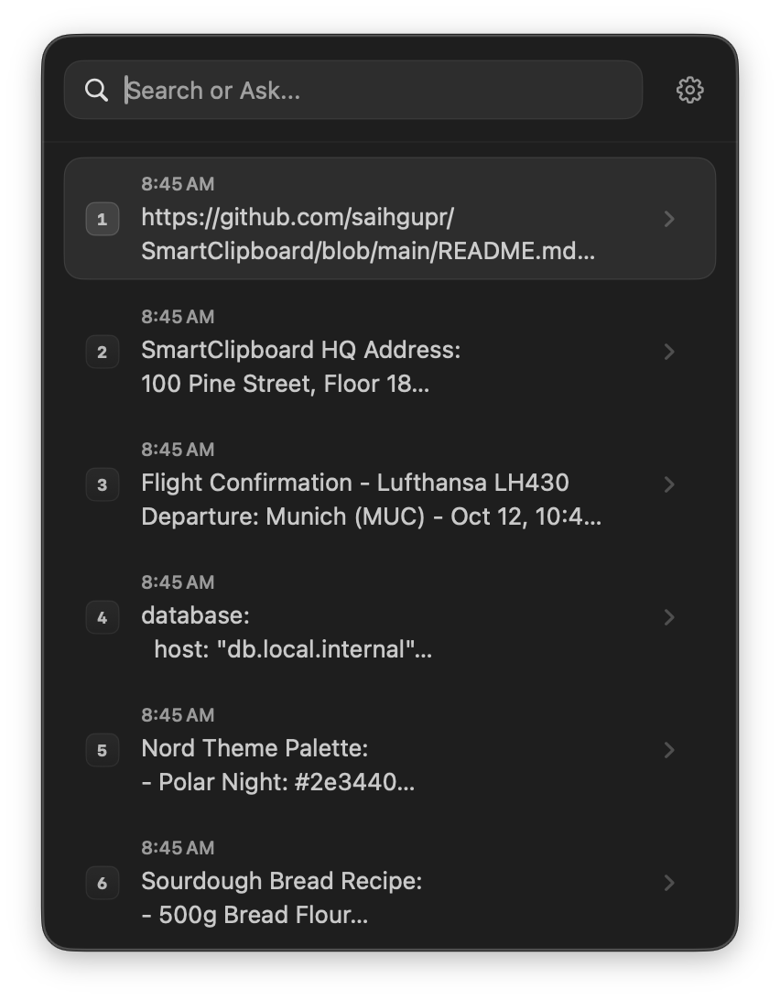
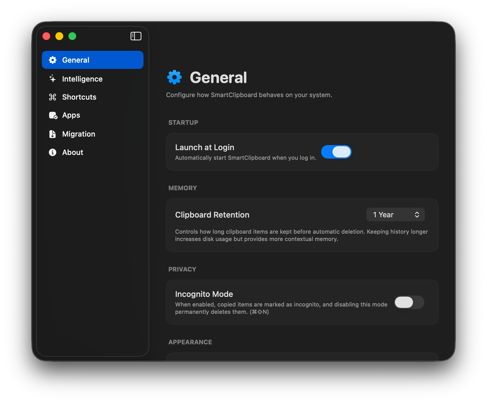
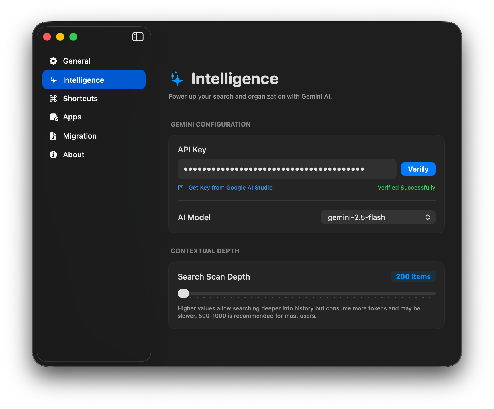
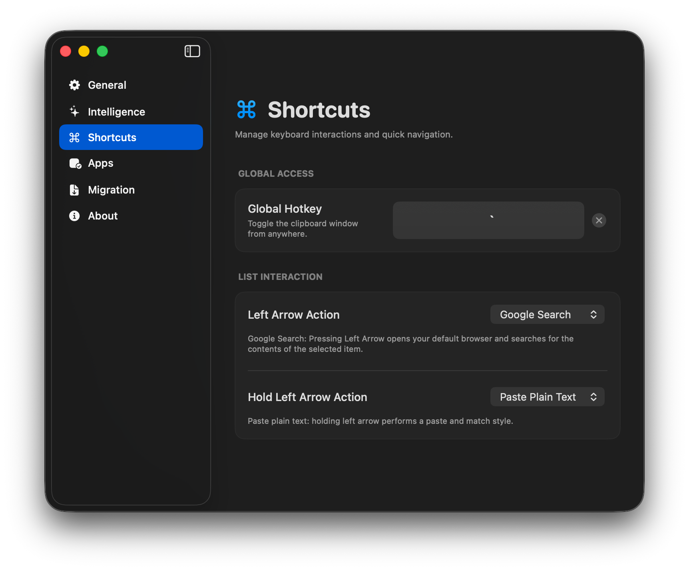
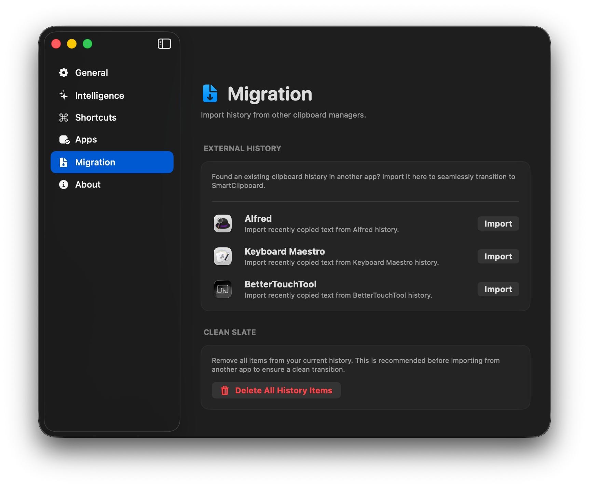

# SmartClipboard

SmartClipboard is a modern macOS menu bar application built with SwiftUI that enhances your clipboard experience with AI-powered semantic search.

## Features

- **Always Accessible**: Lives in your macOS menu bar for quick access anytime.
- **Dual UI Modes**: Triggering the app from the menu bar opens a focused popover, while using the global hotkey reveals a **center-screen floating window** (Spotlight-style).
- **Sequential Pasting**: Rapidly paste multiple previous items in order using `Option + [1-9]`. Perfect for batch-filling forms or re-sequencing snippets.
- **Incognito Mode**: Start a private session where copied items are temporarily recorded, then permanently purged as soon as the mode is disabled.
- **Pins & Favorites**: Pin frequently used items to the top or mark them as favorites to protect them from automatic history pruning.
- **History Import**: Seamlessly migrate your existing clipboard history from **Alfred**, **BetterTouchTool**, or **Keyboard Maestro**.
- **Paginated History**: Optimized UI that handles thousands of items with zero lag using an intelligent pagination system.
- **Quick Actions**: Use the **Left Arrow** key to perform customizable actions (*Flash Copy*, *Google Search*, *Pin*, or *Instant Delete*) from both list and detail views. If a Left Arrow action is triggered on a valid URL, it automatically opens the URL directly instead of searching.
- **Seamless Detail View Navigation**: Hitting **Right Arrow** opens the detail view, and **Up/Down** arrows let you browse items without leaving the detail view.
- **Global Shortcuts**: Center-screen floating window access via customizable hotkey and instant indexed pasting using `Cmd + [1-9]`.
- **Semantic Search**: Ask natural language questions like "Where was that API key?" or "Find that snippet about database migrations" using Gemini AI.
- **Smart Insertion**: Automatically detects chat apps like Slack or Discord to use `Shift+Enter` during multi-pastes.
- **Privacy First**: Automatically filters sensitive data from password managers and respects `org.nspasteboard.ConcealedType` flags.
- **High Performance**: Ultra-fast local search and SwiftData persistence layer optimized for zero-latency interactions.

## Screenshots

   
  <em>Spotlight-style floating search window</em>

  
   
  <em>Menu Bar Popover List (left) and Detailed Content Inspector (right)</em>

  
   
  <em>Gemini-powered Semantic Search (left) and General Application Settings (right)</em>

   
  <em>Gemini Model Selection and Depth Configuration</em>

## Keyboard Shortcuts

| Shortcut | Context | Action |
| --- | --- | --- |
| `Cmd + Option + V` (default) | Global | Toggle SmartClipboard search window (Spotlight-style) |
| `Cmd + [1-9]` | Main List | Instant indexed paste of the corresponding item |
| `Option + [1-9]` | Main List | Sequential multi-paste (perfect for batch filling forms) |
| `Cmd + Shift + N` | Any | Toggle **Incognito Mode** |
| `Right Arrow` | Main List | Open detail view for the selected item |
| `Left Arrow` | Main List | Perform configured quick action (Quick Copy, Pin, etc.) |
| `Left Arrow` | Detail View | Return to main list |
| `Up / Down Arrow` | Detail View | Navigate and view previous / next item content |
| `Cmd + C` | Detail View | Copy item to clipboard without closing window (or copies text selection if active) |
| `Escape` | Any | Close detail view / dismiss SmartClipboard window |

## Technology Stack

- **SwiftUI**: For a native, modern macOS user interface.
- **AppKit**: Efficient clipboard monitoring via `NSPasteboard`.
- **SwiftData**: Modern, high-performance persistence layer for your history.
- **Gemini API**: Deep integration with Google's Gemini models for intelligent semantic analysis.
- **XcodeGen**: Clean project management and version control.

## Getting Started

### Prerequisites

- macOS 13.0 or later
- Xcode 15.0 or later
- A [Google Gemini API Key](https://aistudio.google.com/app/apikey)
