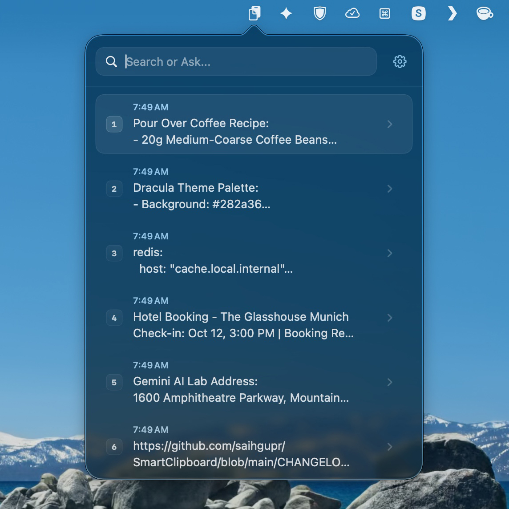
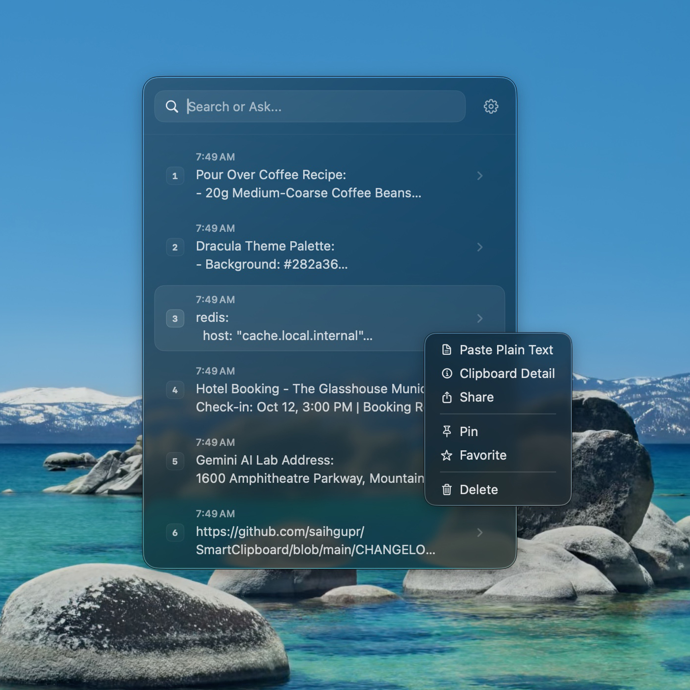
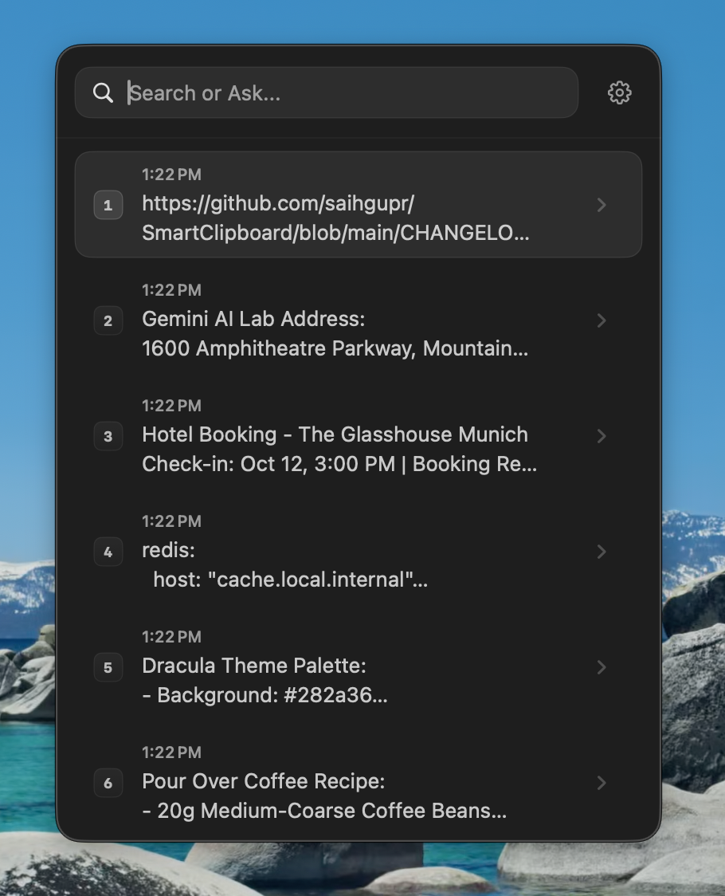
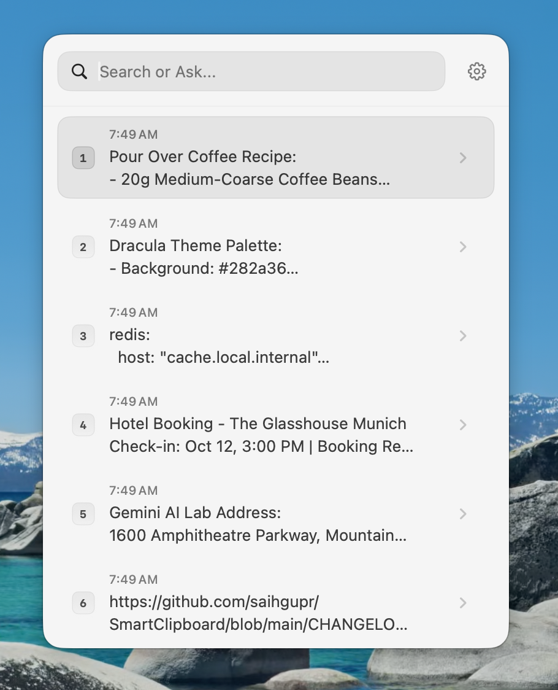

# SmartClipboard

SmartClipboard is a modern macOS menu bar application built with SwiftUI that enhances your clipboard experience with AI-powered semantic search.

<p align="center">
  
  
</p>

## Features

- **AI-Powered Semantic Search**: Ask natural language questions like *"Where was that API key?"* or *"Find the code snippet"* using Gemini AI.
- **Dual Interface Layouts**: Access quickly via a lightweight menu bar popover or invoke a Spotlight-style center-screen floating window.
- **Power-User Shortcuts**: Quick indexed pasting (`Cmd + [1-9]`), sequential pasting (`Option + [1-9]` for batch forms), and rapid navigation using Arrow keys.
- **Privacy & Security**: Incognito sessions, automatic password manager filtering, and local secure storage.
- **Seamless Migration**: Built-in history importer for Alfred, BetterTouchTool, and Keyboard Maestro.

## Appearance & Themes

SmartClipboard is designed to look modern and native on macOS. Choose between three premium styles:

| Glass | Dark | Light |
| :---: | :---: | :---: |
|  |  |  |


## Settings

<p align="center">
  
  
</p>

<p align="center">
  
  
</p>

## Keyboard Shortcuts

| Shortcut | Context | Action |
| --- | --- | --- |
| `Cmd + Option + V` (default) | Global | Toggle SmartClipboard search window (Spotlight-style) |
| `Cmd + [1-9]` | Main List | Instant indexed paste of the corresponding item |
| `Option + [1-9]` | Main List | Sequential multi-paste (perfect for batch filling forms) |
| `Cmd + Shift + N` | Any | Toggle **Incognito Mode** |
| `Right Arrow` | Main List | Open detail view for the selected item |
| `Left Arrow` | Main List | Perform configured quick action (Quick Copy, Pin, etc.) |
| `Left Arrow` | Detail View | Return to main list |
| `Up / Down Arrow` | Detail View | Navigate and view previous / next item content |
| `Cmd + C` | Detail View | Copy item to clipboard without closing window (or copies text selection if active) |
| `Escape` | Any | Close detail view / dismiss SmartClipboard window |

## Getting Started

### Prerequisites

- macOS 13.0 or later
- Xcode 15.0 or later
- A [Google Gemini API Key](https://aistudio.google.com/app/apikey)

### Installation

Choose one of the following methods to install SmartClipboard:

#### Option 1: Standard Installation (Recommended)

1. Download the latest `.dmg` installer from [GitHub Releases](https://github.com/saihgupr/SmartClipboard/releases).
2. Open the downloaded `.dmg` and drag `SmartClipboard` to your `/Applications` folder.

#### Option 2: Build from Source (Developers)

1. Clone the repository:
   ```bash
   git clone https://github.com/saihgupr/SmartClipboard.git
   cd SmartClipboard
   ```

2. Generate the Xcode project:
   ```bash
   xcodegen generate
   ```

3. Build and run the project in Xcode (`Cmd + R`) or run the included `deploy.sh` script to install it directly to `/Applications`.

*Once installed, provide your Gemini API key in the app settings to enable semantic search features.*

### macOS Security (Gatekeeper) Warning

Because SmartClipboard is a free, open-source application and is not signed with a paid Apple Developer ID, macOS Gatekeeper will block it on first launch with a warning saying it "cannot be opened because Apple cannot verify it for malware".

To open the app, you can use any of the following standard methods:

1. **Right-Click Open**: Right-click (or Control-click) `SmartClipboard.app` in your `/Applications` directory, select **Open**, and then click **Open** on the confirmation dialog.
2. **System Settings Override**: Go to **System Settings > Privacy & Security**, scroll down to the **Security** section, and click **Open Anyway** next to the warning about SmartClipboard.
3. **Terminal Command**: Run the following command in Terminal to strip the quarantine attribute:
   ```bash
   xattr -d com.apple.quarantine /Applications/SmartClipboard.app
   ```

### Contributing & Support

* **Issues & Bug Reports**: If you find any bugs or have feature requests, please report them in the [Issue Tracker](https://github.com/saihgupr/SmartClipboard/issues).
* **Pull Requests**: Contributions are welcome! Feel free to fork the repository and open a [Pull Request](https://github.com/saihgupr/SmartClipboard/pulls).
* **Support the Project**: If you enjoy using SmartClipboard, you can support its development by [donating on Ko-fi](https://ko-fi.com/saihgupr).
