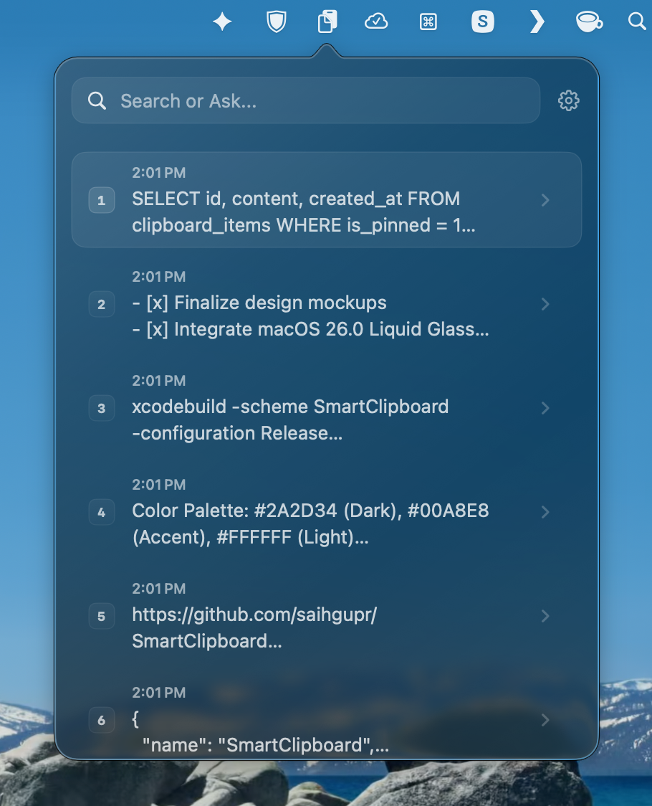
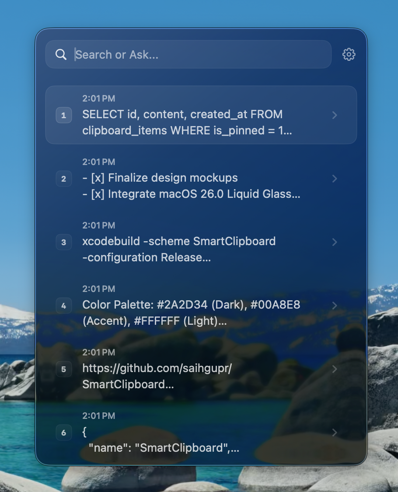
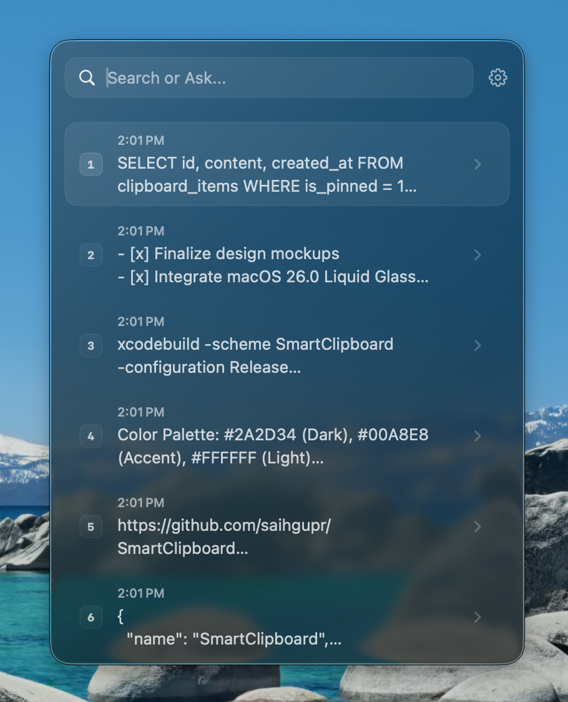
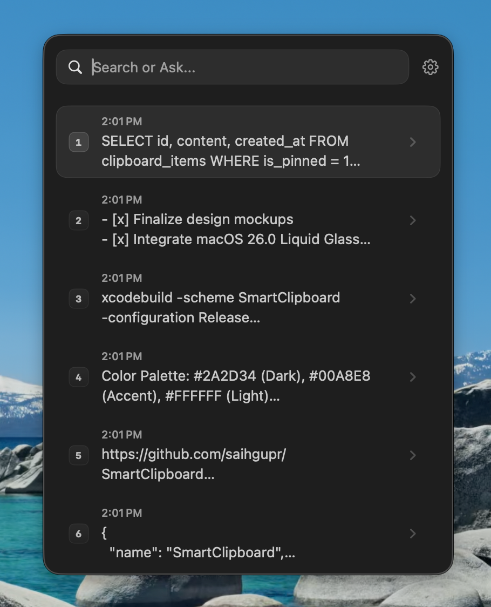
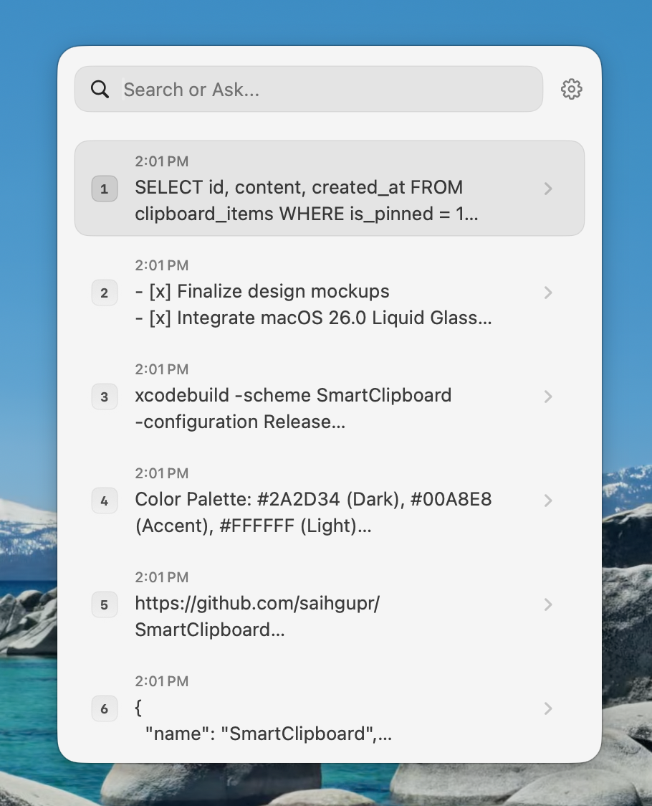
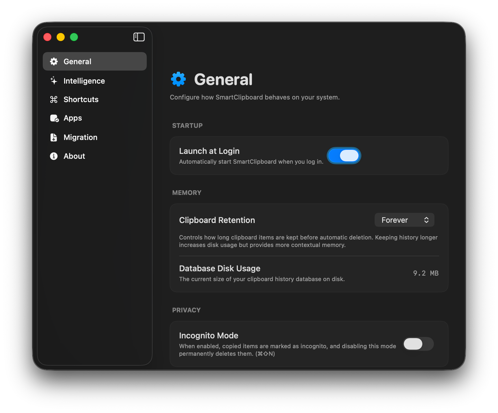

# SmartClipboard

SmartClipboard is a modern macOS menu bar application built with SwiftUI that enhances your clipboard experience with AI-powered semantic search.

<p align="center">
  
  
</p>

## Features

* AI Search: Find anything in your clipboard by asking a question in plain English. For example, “Where was that API key?” or “Find the code snippet.” Powered by Gemini AI.
* Find by Date or Time: Search for items you copied using terms like “today”, “yesterday”, “Monday”, “2:30 PM”, “July 13”, or “07/13”.
* Two Ways to Access Your Clipboard: Open it from the menu bar for quick access, or use a Spotlight-style floating window that appears in the center of your screen.
* Keyboard-First Shortcuts:
    * Paste recent items instantly with ⌘ + 1–9.
    * Paste multiple items in order with ⌥ + 1–9, useful for filling out forms.
    * Browse your clipboard using the arrow keys.
* Privacy & Security: Use incognito mode when you don’t want items saved. Clipboard entries from password managers are automatically ignored, and all history is stored securely on your device.
* Easy Migration: Import your existing clipboard history from Alfred, BetterTouchTool, or Keyboard Maestro in a few clicks.

## Appearance & Themes

SmartClipboard is designed to look modern and native on macOS. Choose between four premium styles:

<table>
  <tr>
    <td></td>
    <td></td>
    <td></td>
    <td></td>
  </tr>
  <tr align="center">
    <td><b>Dark Glass</b></td>
    <td><b>Glass</b></td>
    <td><b>Dark</b></td>
    <td><b>Light</b></td>
  </tr>
</table>


## Settings

<p align="center">
  
  
</p>

<p align="center">
  
  
</p>

## Keyboard Shortcuts

| Shortcut | Context | Action |
| --- | --- | --- |
| `Cmd + Option + V` (default) | Global | Toggle SmartClipboard search window (Spotlight-style) |
| `Cmd + [1-9]` | Main List | Instant indexed paste of the corresponding item |
| `Option + [1-9]` | Main List | Sequential multi-paste (perfect for batch filling forms) |
| `Cmd + Shift + N` | Any | Toggle **Incognito Mode** |
| `Right Arrow` | Main List | Open detail view for the selected item |
| `Left Arrow` | Main List | Perform configured quick action (Quick Copy, Pin, etc.) |
| `Left Arrow` | Detail View | Return to main list |
| `Up / Down Arrow` | Detail View | Navigate and view previous / next item content |
| `Cmd + C` | Detail View | Copy item to clipboard without closing window (or copies text selection if active) |
| `Escape` | Any | Close detail view / dismiss SmartClipboard window |

## Getting Started

### Prerequisites

- macOS 13.0 or later
- Xcode 15.0 or later
- A [Google Gemini API Key](https://aistudio.google.com/app/apikey)

### Installation

Choose one of the following methods to install SmartClipboard:

#### Option 1: Standard Installation (Recommended)

1. Download the latest `.dmg` installer from [GitHub Releases](https://github.com/saihgupr/SmartClipboard/releases).
2. Open the downloaded `.dmg` and drag `SmartClipboard` to your `/Applications` folder.

#### Option 2: Build from Source (Developers)

1. Clone the repository:
   ```bash
   git clone https://github.com/saihgupr/SmartClipboard.git
   cd SmartClipboard
   ```

2. Generate the Xcode project:
   ```bash
   xcodegen generate
   ```

3. Build and run the project in Xcode (`Cmd + R`) or run the included `deploy.sh` script to install it directly to `/Applications`.

*Once installed, provide your Gemini API key in the app settings to enable semantic search features.*

### macOS Security (Gatekeeper) Warning

Because SmartClipboard is a free, open-source application and is not signed with a paid Apple Developer ID, macOS Gatekeeper will block it on first launch with a warning saying it "cannot be opened because Apple cannot verify it for malware".

To open the app, you can use any of the following standard methods:

1. **Right-Click Open**: Right-click (or Control-click) `SmartClipboard.app` in your `/Applications` directory, select **Open**, and then click **Open** on the confirmation dialog.
2. **System Settings Override**: Go to **System Settings > Privacy & Security**, scroll down to the **Security** section, and click **Open Anyway** next to the warning about SmartClipboard.
3. **Terminal Command**: Run the following command in Terminal to strip the quarantine attribute:
   ```bash
   xattr -d com.apple.quarantine /Applications/SmartClipboard.app
   ```

## Contributing

Contributions are welcome! 

1. Fork the repository
2. Create a feature branch (`git checkout -b feature/awesome-feature`)
3. Commit your changes and push to your fork
4. Open a Pull Request

## Support & Feedback

If you encounter any issues, bugs, or have feature requests, please [open an issue on GitHub](https://github.com/saihgupr/SmartClipboard/issues).

SmartClipboard is open-source and free. If you find it useful, consider giving it a star ⭐ or making a donation to support development!

[](https://ko-fi.com/saihgupr)
